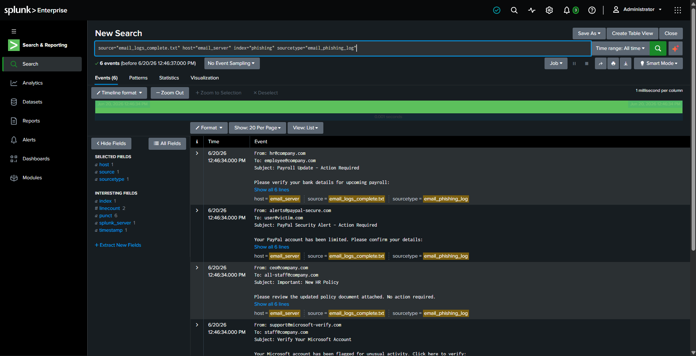
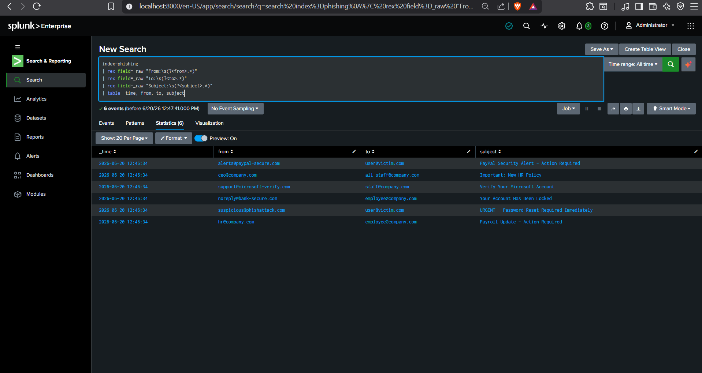
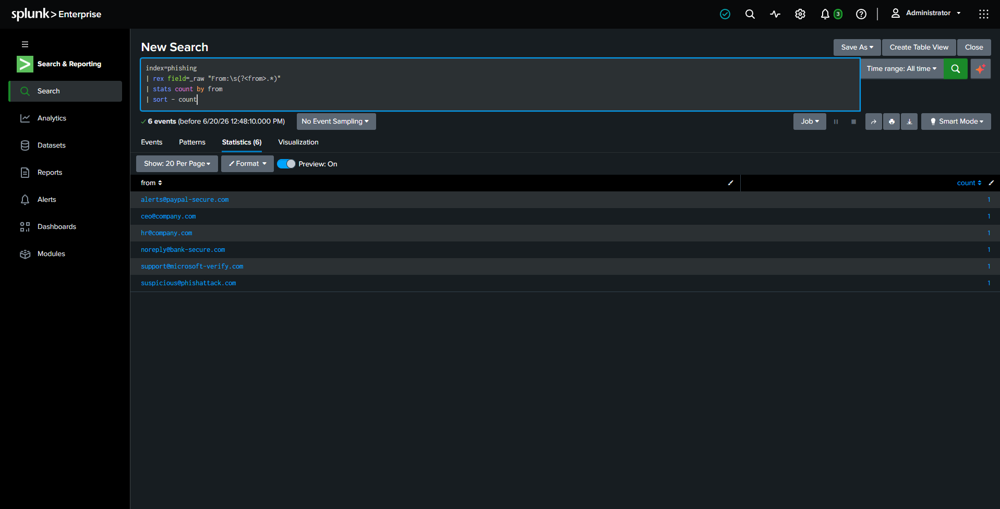
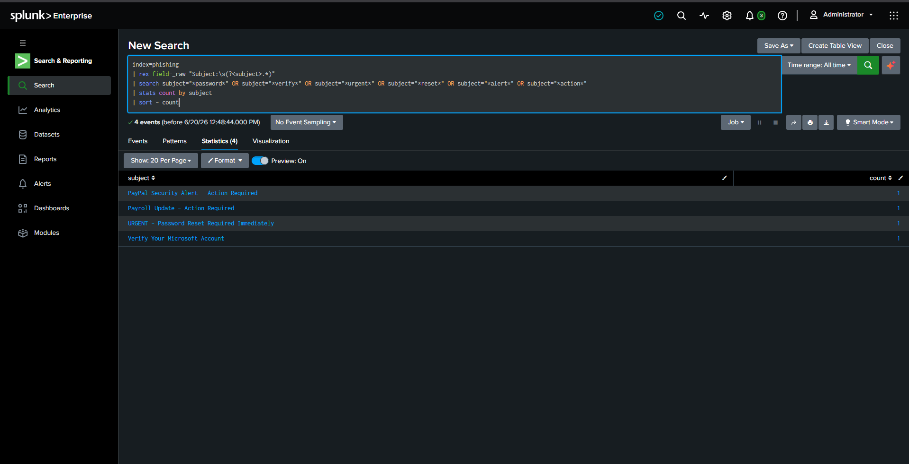
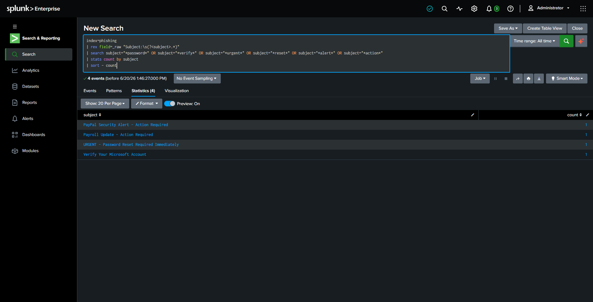
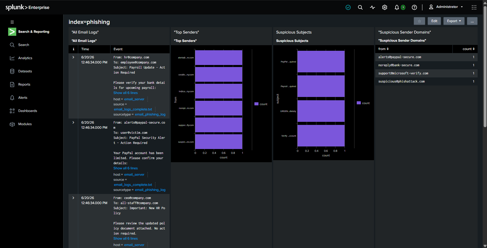

# Phishing Email Detection & Analysis — SOC Investigation

> A hands-on SOC investigation project demonstrating phishing detection using Splunk Enterprise. Extracted email fields, identified suspicious patterns, and built a detection dashboard.

---

## 📌 Project Overview

This project simulates a SOC analyst investigation of suspicious emails. Using Splunk, I uploaded email logs, extracted key fields (From, To, Subject), and identified phishing attempts by analyzing suspicious patterns.

### The Scenario

A company received multiple suspicious emails. As a SOC analyst, I used Splunk to analyze email logs and identify potential phishing attacks targeting employees.

### Attack Type Investigated

**Phishing (T1566)** — attackers send fake emails to trick users into clicking malicious links or sharing credentials.

---

## 🛠️ Tools & Environment

| Tool | Purpose |
|------|---------|
| Splunk Enterprise | SIEM platform for log analysis |
| Email Logs | Sample email data containing suspicious messages |
| SPL | Splunk's search language for queries |
| MITRE ATT&CK | Framework for mapping attacker techniques |

---

## 📊 Investigation Steps

### Step 1: Data Ingest

Uploaded sample email logs into Splunk with custom source type.

```spl
index=phishing | stats count
```

**Result:** 6 events loaded successfully



---

### Step 2: Field Extraction

Extracted key fields (From, To, Subject) from raw email logs using `rex`:

```spl
index=phishing
| rex field=_raw "From:\s(?<from>.*)"
| rex field=_raw "To:\s(?<to>.*)"
| rex field=_raw "Subject:\s(?<subject>.*)"
| table _time, from, to, subject
```



---

### Step 3: Top Senders

Identified all email senders and their counts:

```spl
index=phishing
| rex field=_raw "From:\s(?<from>.*)"
| stats count by from
| sort - count
```



---

### Step 4: Suspicious Subjects

Detected emails with suspicious keywords:

```spl
index=phishing
| rex field=_raw "Subject:\s(?<subject>.*)"
| search subject="*password*" OR subject="*verify*" OR subject="*urgent*" OR subject="*reset*" OR subject="*alert*" OR subject="*action*"
| stats count by subject
| sort - count
```



---

### Step 5: Suspicious Domains

Identified suspicious sender domains:

```spl
index=phishing
| rex field=_raw "From:\s(?<from>.*)"
| search from="*phish*" OR from="*verify*" OR from="*secure*" OR from="*xyz*" OR from="*net*"
| stats count by from
| sort - count
```



---

### Step 6: Dashboard Creation

Built a complete phishing detection dashboard with 4 panels:

| Panel | Type | Purpose |
|-------|------|---------|
| All Email Logs | Events | Shows all emails |
| Top Senders | Bar Chart | Identify frequent senders |
| Suspicious Subjects | Bar Chart | Detect malicious keywords |
| Suspicious Domains | Table | Identify spoofed domains |



---

## 🔑 Key Findings

| Finding | Detail |
|---------|--------|
| **Suspicious Senders** | suspicious@phishattack.com, noreply@bank-secure.com, support@microsoft-verify.com, alerts@paypal-secure.com |
| **Suspicious Domains** | phishattack.com, secure-bank-verify.xyz, paypal-security-verify.org |
| **Suspicious Subjects** | "Password Reset", "Account Locked", "Verify Your Account", "PayPal Security Alert" |
| **Legitimate Email** | ceo@company.com (no suspicious indicators) |

---

## 🏛️ MITRE ATT&CK Mapping

| Technique | ID |
|-----------|-----|
| Phishing | T1566 |
| Spearphishing Link | T1566.002 |

---

## 🛡️ Recommendations

| Priority | Action |
|----------|--------|
| **HIGH** | Block suspicious domains at the email gateway |
| **HIGH** | Implement SPF/DKIM/DMARC to prevent spoofing |
| **MEDIUM** | Conduct security awareness training on phishing |
| **MEDIUM** | Enable email filtering for suspicious keywords |

---

## 📁 Repository Structure

```
Phishing-Email-Detection-SOC/
├── README.md
├── screenshots/
│   ├── 01_data_ingest.png
│   ├── 02_field_extraction.png
│   ├── 03_top_senders.png
│   ├── 04_suspicious_subjects.png
│   ├── 05_suspicious_domains.png
│   └── 06_dashboard.png
├── detections/
│   └── phishing_detection.spl
└── reports/
    └── Phishing_Investigation_Report.md
```

---

## 👤 About Me

**Kaustubh Rohidas Mahadik**
Aspiring SOC Analyst | Cybersecurity Enthusiast

> *"This project demonstrates hands-on phishing detection skills — log analysis, field extraction, threat hunting, dashboard creation, and incident reporting using Splunk."*

---

## 📎 References

- [MITRE ATT&CK Framework](https://attack.mitre.org/)
- [Splunk Documentation](https://docs.splunk.com/)
